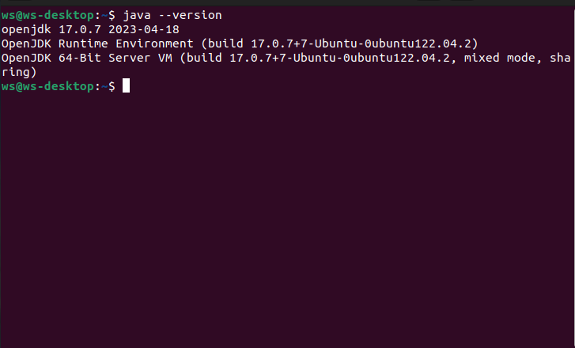
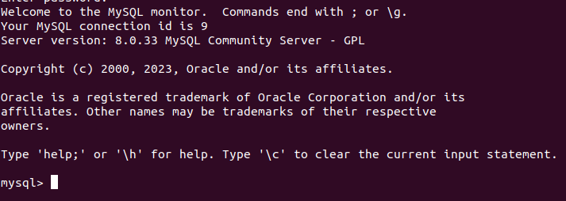
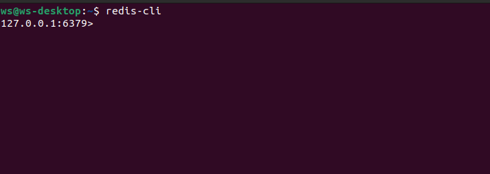

# SearcheEngine

## Описание

Поисковый вэб-движок выполнен на Java 17, позволяющий обходить заданные в конфигурационном файле сайты,
имеет следующий функционал:

1) Обход всех страниц относящиеся к сайту (выполнение индексации);
2) Извлечение и преобразование в исходную форму всех слов отдельно от html кода страницы;
3) Запись в базу данных MySQL и Redis;
4) Выполнение индексации отдельной страницы.
5) Выполнения поиска как по всем сайтам, так и по отдельному сайту.

## Стэк используемых технологий:

1) Spring Boot;
2) Spring Data;
3) MySql;
4) Redis;
5) JSOUP;
6) Lucene morphology;
7) Lombok.

## Установка:

Для операционной системы Linux Ubuntu необходимо выполнить следующие действия:
1. Открыть терминал Linux.

2. Получить права супер пользователя командой __sudo -s__. Перейти в папку где содержится скрипт __/readmiresources/scripts/__ и запустить его командой __./install.sh__\
Если появляется ошибка __Отказанно в доступе__, то в правах доступа .sh файла поставить галочку __Использовать как приложение__.
### Альтернативный вариант
3. Установка JVM:
   - __sudo apt update__
   - __sudo apt install openjdk-17-jre-headless__
   - __java --version__

Должно появится сообщение об версии JVM.\

4. Установка MySQL:
- __sudo apt install mysql-server__
- __sudo mysql__\

- __drop user admin@localhost;__
- __flush privileges;__
- __CREATE USER 'username'@'host' IDENTIFIED BY 'password';__\
 где username имя нового пользователя\
   __host__: адрес нахождения БД, если БД находится локально, то ввести localhost\
   __password__ - пароль с кавычками.
- __GRANT ALL PRIVILEGES ON *.* TO 'username'@'host' WITH GRANT OPTION;__
- __CREATE DATABASE search_engine;__\
   Должно появится сообщение OK, это сигнализирует, что БД создана. 
- __exit__;
- вход будет осуществлятся командой __mysql -u__ 'имя пользователя' __-p__
   
5. Установка REDIS:
- __sudo snap install redis__
- __sudo service redis-server-start__
- __redis-cli__\
  

Для операционной системы Windows необходимо выполнить следующие действия:
1. Скачать [Java 17](https://download.oracle.com/java/17/latest/jdk-17_windows-x64_bin.exe) и запустить exe файл.
2. Скачать [MySQL Workbench](https://deaptv.mysql.com/get/Downloads/MySQLGUITools/mysql-workbench-community-8.0.33-winx64.msi)
 и установить.
3. В MySQL создать базу данных с названием __search_engine__.
4. Установка Redis:
- выполнить инструкции приведённые по  [ссылке](https://learn.microsoft.com/en-us/windows/wsl/install)
- открыть Ubuntu LS
- __sudo apt-get update__
- __sudo apt-get install redis__
- __sudo service redis-server start__\
  
## Конфигурирование приложения 
1. Разместить файл application.yml в одной дирректории вмести с исполняемым  .jar файлом
2. Открыть файл в любом текстовом редакторе, ввести следующие данные:
- __username__: имя пользователя в MySQL;
- __password__: пароль от БД MYSQL;
- __url__: адрес БД MYSQL;
- __ddl-auto__: выбрать _create_ (создать БД) или _update_(обновлять БД);
- __host__: адрес БД Redis, по умолчанию _127.0.0.1_;
- __port__: порт, по умолчанию _6379_.
3. C помощью терминала или командной строки в зависимости от ОС:
- перейти в дирректорию содержащую исполняемый _.jar_ файл;
- выполнить команду __java jar <имя файла без скобок>.jar__ .  
